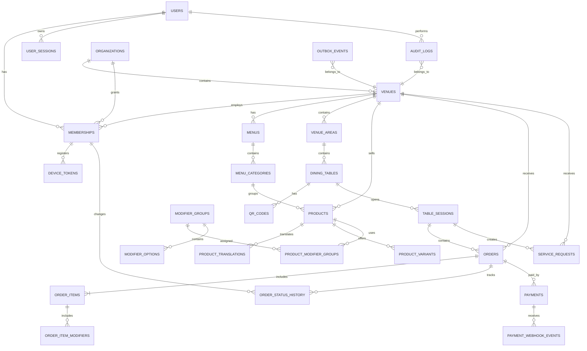

# TINGGO — PRODUCT REQUIREMENT & TECHNICAL PLANNING

**Phiên bản:** 0.1
**Phạm vi:** MVP Pilot
**Thời gian dự kiến:** 1–2 tuần
**Đội ngũ:** 01 Full-stack Web Developer, 01 Full-stack Mobile Developer, Project Manager/Product Owner

---

# 1. TÊN VÀ MÔ TẢ SẢN PHẨM

## 1.1. Tên khuyến nghị: TingGo

### Ý nghĩa

- **Ting:** âm báo khi quán nhận được đơn.
- **Go:** thao tác nhanh, sử dụng ngay, không cần máy móc phức tạp.
- Ngắn, dễ đọc bằng cả tiếng Việt và tiếng Anh. (Multi Language Support)
- Không giới hạn sản phẩm trong riêng menu QR.
- Có thể mở rộng thành hệ sinh thái: TingGo Order, TingGo Kitchen, TingGo Pay.

### Tagline tiếng Việt

> **Quét bàn, gọi món, quán nhận ngay.**

### Tagline tiếng Anh

> **Scan. Order. Serve.**

### Thông điệp chính

> TingGo giúp quán ăn, quán nước và cafe nhận order trực tiếp từ điện thoại của khách. Khách quét QR tại bàn để xem menu, gọi món và theo dõi đơn; quán nhận báo ngay trên điện thoại mà không cần đầu tư máy POS đắt tiền.

---

## 1.2. Mô tả ngắn

### Mô tả website

> TingGo là nền tảng menu QR và nhận order theo thời gian thực dành cho quán ăn, quán nước và cafe. Khách tự gọi món tại bàn, quán nhận đơn tức thì, hạn chế sai món, sót đơn và thời gian chờ.

### Mô tả ứng dụng dành cho chủ quán

> Nhận order QR ngay trên điện thoại, quản lý menu, bàn, trạng thái món, thanh toán và doanh thu của quán.

### Mô tả ngắn cho App Store/Google Play

> Nhận order QR theo bàn, báo đơn tức thì, quản lý menu và doanh thu ngay trên điện thoại.

### Mô tả tiếng Anh

> TingGo is a QR ordering platform for restaurants, cafés and small food businesses. Customers scan a table QR code to browse the menu, place orders and track order status, while merchants receive and manage orders instantly from their phones.

---

## 1.3. Các tên dự phòng

| Tên     | Định hướng              | Nhận xét                    |
| ------- | ----------------------- | --------------------------- |
| TingGo  | Việt Nam và quốc tế     | Khuyến nghị                 |
| TingBàn | Thân thiện tại Việt Nam | Khó mở rộng quốc tế         |
| MónTới  | Gần gũi, dễ nhớ         | Phù hợp thị trường Việt Nam |
| MenuTap | Quốc tế, mô tả rõ       | Hơi thiên về menu           |
| TableGo | Quốc tế                 | Dễ hiểu nhưng khá chung     |
| BànNè   | Trẻ trung, địa phương   | Không phù hợp mọi phân khúc |

### Quyết định tạm thời

Sử dụng:

```text
Brand: TingGo
Product: TingGo Order
Merchant app: TingGo Merchant
Kitchen display: TingGo Kitchen
```

---

# 2. PRODUCT REQUIREMENT DOCUMENT — PRD

## 2.1. Tầm nhìn sản phẩm

Trở thành công cụ nhận order đơn giản nhất cho các quán ăn, quán nước và cafe nhỏ, giúp quán bắt đầu sử dụng trong vài phút mà không cần mua máy POS hoặc thay đổi toàn bộ quy trình vận hành.

---

## 2.2. Vấn đề cần giải quyết

Các quán nhỏ thường gặp:

1. Nhân viên ghi sai món hoặc thiếu món.
2. Khách phải gọi nhân viên nhiều lần.
3. Đơn giấy dễ mất hoặc khó đọc.
4. Chủ quán không biết món nào đang chờ.
5. Khó cập nhật giá và món hết hàng.
6. Không có dữ liệu doanh thu theo món và giờ.
7. Phần mềm POS hiện tại có thể quá phức tạp hoặc cần thêm thiết bị.

---

## 2.3. Đối tượng người dùng

### Chủ quán

- Quán có khoảng 5–30 bàn.
- Có từ 1–10 nhân viên.
- Đang ghi order bằng giấy, Excel hoặc tin nhắn.
- Muốn sử dụng điện thoại và máy tính bảng hiện có.

### Nhân viên phục vụ

- Nhận yêu cầu từ khách.
- Theo dõi đơn.
- Xác nhận món.
- Cập nhật trạng thái bàn.

### Nhân viên bếp hoặc quầy pha chế

- Xem món cần thực hiện.
- Cập nhật món đang làm hoặc đã hoàn thành.

### Khách hàng

- Quét QR bằng điện thoại.
- Không cần đăng ký tài khoản.
- Không cần tải ứng dụng.

### Platform Administrator

- Quản lý quán và tài khoản.
- Xử lý sự cố.
- Kiểm tra thanh toán và webhook.
- Hỗ trợ khách hàng.

---

## 2.4. Mục tiêu MVP

MVP phải cho phép một quán thực hiện đầy đủ quy trình:

```text
Tạo quán
→ Tạo menu
→ Tạo bàn và QR
→ Khách quét QR
→ Khách gửi order
→ Quán nhận thông báo
→ Quán xác nhận và xử lý
→ Khách theo dõi trạng thái
→ Quán đóng đơn và xem doanh thu
```

---

## 2.5. Chỉ số thành công

| Chỉ số                                      |                            Mục tiêu MVP |
| ------------------------------------------- | --------------------------------------: |
| Thời gian tạo quán đến order thử đầu tiên   |                            Dưới 10 phút |
| Thời gian quét QR đến khi thấy menu         |                     Dưới 3 giây trên 4G |
| Độ trễ báo đơn real-time                    | Dưới 2 giây trong điều kiện bình thường |
| Tỷ lệ order trùng do gửi lại request        |                                      0% |
| Tỷ lệ order bị mất sau khi backend xác nhận |                                      0% |
| Tỷ lệ khách hoàn thành order                |   Trên 60% số phiên có thêm món vào giỏ |
| Quán pilot                                  |                        Tối thiểu 5 quán |
| Số order thật trước commercial launch       |                   Tối thiểu 1.000 order |

---

# 3. PHẠM VI MVP

## 3.1. Customer Web

### CUS-01: Truy cập menu bằng QR

Khách quét QR và được đưa đến đúng quán, khu vực và bàn.

**Tiêu chí nghiệm thu:**

- QR đang hoạt động mở đúng bàn.
- QR bị khóa hiển thị thông báo rõ ràng.
- Không yêu cầu đăng nhập.
- Menu hiển thị đúng ngôn ngữ mặc định của quán.

### CUS-02: Xem menu

Khách có thể:

- Xem danh mục.
- Xem ảnh, tên và giá.
- Xem mô tả.
- Nhận biết món hết hàng.
- Tìm kiếm món.

### CUS-03: Chọn món

Khách có thể chọn:

- Số lượng.
- Size.
- Topping.
- Ghi chú.
- Mức đường, đá hoặc tùy chọn tương tự.

Backend phải kiểm tra lại giá và tình trạng món khi gửi order.

### CUS-04: Giỏ hàng

Giỏ hàng hiển thị:

- Từng món.
- Tùy chọn đã chọn.
- Số lượng.
- Đơn giá.
- Tổng tiền.
- Ghi chú chung.

### CUS-05: Gửi order

Khi gửi:

- Frontend tạo `client_order_id`.
- Request gửi kèm `Idempotency-Key`.
- Nút gửi bị khóa trong lúc xử lý.
- Khách nhận mã order.
- Không tạo order trùng khi mạng gửi lại request.

### CUS-06: Theo dõi trạng thái

Khách thấy:

- Đã gửi.
- Quán đã nhận.
- Đang chuẩn bị.
- Món đã sẵn sàng.
- Hoàn thành.
- Bị từ chối hoặc hủy.

### CUS-07: Gọi thêm món

Order mới được thêm vào cùng phiên bàn nhưng có mã order riêng.

### CUS-08: Gọi nhân viên

Các yêu cầu:

- Gọi nhân viên.
- Xin thêm nước hoặc dụng cụ.
- Yêu cầu thanh toán.

### CUS-09: Thông tin quán

Hiển thị:

- Tên quán.
- Giờ mở cửa.
- Wi-Fi.
- Thông tin liên hệ.
- Phương thức thanh toán.

---

## 3.2. Merchant Web

### MER-01: Tạo quán

Chủ quán nhập:

- Tên quán.
- Loại hình.
- Số điện thoại hoặc email.
- Quốc gia.
- Ngôn ngữ.
- Tiền tệ.
- Múi giờ.

### MER-02: Quản lý menu

Chủ quán có thể:

- Tạo danh mục.
- Thêm và sửa món.
- Thêm size.
- Thêm topping.
- Đổi giá.
- Sắp xếp món.
- Bật hoặc tắt món.
- Upload ảnh.

### MER-03: Quản lý khu vực và bàn

- Tạo khu vực.
- Tạo nhiều bàn.
- Đổi tên bàn.
- Khóa bàn.
- Tạo lại QR.
- Tải poster QR.

### MER-04: Bảng order

Hiển thị theo cột:

```text
Đơn mới | Đã xác nhận | Đang làm | Sẵn sàng | Hoàn thành
```

Mỗi order hiển thị:

- Mã order.
- Bàn.
- Thời gian chờ.
- Danh sách món.
- Ghi chú.
- Tổng tiền.
- Trạng thái thanh toán.

### MER-05: Xử lý order

Cho phép:

- Xác nhận.
- Từ chối.
- Bắt đầu chuẩn bị.
- Đánh dấu sẵn sàng.
- Hoàn thành.
- Hủy theo quyền.
- Ghi nhận lý do.

### MER-06: Quản lý phiên bàn

- Mở phiên khi khách bắt đầu order.
- Xem tất cả order của bàn.
- Xem tổng tiền.
- Đóng bàn.
- Mở lại bàn theo quyền quản lý.

### MER-07: Quản lý nhân viên

Vai trò mặc định:

- Owner.
- Manager.
- Cashier.
- Waiter.
- Kitchen.

### MER-08: Báo cáo cơ bản

- Doanh thu trong ngày.
- Số order.
- Giá trị trung bình mỗi order.
- Món bán chạy.
- Doanh thu theo phương thức thanh toán.

---

## 3.3. Merchant Mobile App

### MOB-01: Đăng nhập

- OTP hoặc magic link cho chủ quán.
- Mã nhân viên và PIN cho nhân viên.
- Lưu phiên đăng nhập an toàn.
- Chủ quán có thể thu hồi thiết bị.

### MOB-02: Nhận order

- Push notification.
- SignalR khi app đang mở.
- Âm báo.
- Badge số order mới.
- Không phát lặp âm thanh cho cùng một sự kiện.

### MOB-03: Xử lý order

- Xác nhận hoặc từ chối.
- Chuyển trạng thái.
- Xem ghi chú.
- Lọc theo trạng thái và bàn.

### MOB-04: Quản lý món nhanh

- Bật hoặc tắt món.
- Tìm kiếm món.
- Không cần mở toàn bộ form chỉnh sửa.

### MOB-05: TTS

Ứng dụng có thể đọc:

> “Bàn số 5 có đơn mới: hai cà phê sữa, một trà đào ít đường.”

TTS thuộc gói Premium nhưng kiến trúc cần chuẩn bị từ đầu.

### MOB-06: Khôi phục kết nối

Khi app quay lại foreground:

1. Kiểm tra kết nối.
2. Gọi API lấy order đang hoạt động.
3. So sánh dữ liệu local.
4. Kết nối lại SignalR.
5. Tiếp tục nhận sự kiện mới.

---

# 4. NGOÀI PHẠM VI MVP

Không phát triển trong MVP:

- Giao hàng.
- Quản lý tài xế.
- Đặt bàn.
- Quản lý kho nguyên liệu.
- Loyalty.
- Voucher phức tạp.
- Hóa đơn điện tử.
- Đa chi nhánh.
- AI dự báo.
- Menu theo thời tiết.
- Tích hợp mọi loại máy in.
- Kết nối với nhiều POS bên ngoài.

---

# 5. YÊU CẦU PHI CHỨC NĂNG

## 5.1. Hiệu năng

- Public menu có thể cache.
- API đọc menu mục tiêu dưới 500 ms ở điều kiện bình thường.
- Order write API mục tiêu dưới 1 giây.
- SignalR notification dưới 2 giây.
- Ảnh được resize và phân phối qua CDN.

## 5.2. Khả dụng

- Hệ thống thương mại mục tiêu uptime tối thiểu 99,9%.
- Database có backup tự động.
- Có quy trình restore.
- Order đã được database xác nhận không được phụ thuộc notification thành công.

## 5.3. Bảo mật

- HTTPS bắt buộc.
- Rate limiting.
- Refresh token rotation.
- OTP expiration.
- Kiểm tra quyền tại backend.
- Audit log.
- Validation request.
- Idempotency.
- Webhook signature verification.
- Tenant isolation.

## 5.4. Quốc tế hóa

Mỗi quán có:

```text
country_code
default_locale
currency_code
timezone
tax_configuration
```

Không hard-code:

- VNĐ.
- Định dạng ngày Việt Nam.
- Số điện thoại Việt Nam.
- Text tiếng Việt.
- Thuế suất.

---

# 6. ERD DATABASE

## 6.1. Quy ước

- Primary key dùng UUID.
- Thời gian lưu UTC.
- Tiền lưu bằng đơn vị nhỏ nhất dưới dạng `BIGINT`.
- Không dùng `float` hoặc `double` để lưu tiền.
- Bảng nghiệp vụ phải có `created_at`.
- Bảng có chỉnh sửa phải có `updated_at`.
- Orders và payments không xóa vật lý.
- Dùng `row_version` để xử lý cập nhật đồng thời.
- Dùng `organization_id` và `venue_id` để cô lập tenant.

---

## 6.2. ERD logic



---

## 6.3. Các bảng chính

### organizations

| Field            | Type         | Ghi chú           |
| ---------------- | ------------ | ----------------- |
| id               | UUID         | Primary key       |
| name             | VARCHAR(200) | Tên tổ chức       |
| status           | VARCHAR(32)  | active, suspended |
| default_locale   | VARCHAR(10)  | vi-VN             |
| default_currency | CHAR(3)      | VND               |
| created_at       | TIMESTAMPTZ  | UTC               |
| updated_at       | TIMESTAMPTZ  | UTC               |

### venues

| Field                   | Type         | Ghi chú            |
| ----------------------- | ------------ | ------------------ |
| id                      | UUID         | Primary key        |
| organization_id         | UUID         | Foreign key        |
| name                    | VARCHAR(200) | Tên quán           |
| slug                    | VARCHAR(100) | Unique public slug |
| country_code            | CHAR(2)      | VN                 |
| timezone                | VARCHAR(64)  | Asia/Ho_Chi_Minh   |
| default_locale          | VARCHAR(10)  | vi-VN              |
| currency_code           | CHAR(3)      | VND                |
| status                  | VARCHAR(32)  | active, inactive   |
| wifi_name               | VARCHAR(200) | Nullable           |
| wifi_password_encrypted | TEXT         | Nullable           |
| row_version             | BIGINT       | Concurrency        |
| created_at              | TIMESTAMPTZ  |                    |
| updated_at              | TIMESTAMPTZ  |                    |

### users

| Field        | Type         | Ghi chú          |
| ------------ | ------------ | ---------------- |
| id           | UUID         | Primary key      |
| email        | VARCHAR(320) | Nullable, unique |
| phone_e164   | VARCHAR(32)  | Nullable, unique |
| display_name | VARCHAR(200) |                  |
| status       | VARCHAR(32)  | active, blocked  |
| created_at   | TIMESTAMPTZ  |                  |
| updated_at   | TIMESTAMPTZ  |                  |

### memberships

| Field           | Type        | Ghi chú                         |
| --------------- | ----------- | ------------------------------- |
| id              | UUID        | Primary key                     |
| user_id         | UUID        | Foreign key                     |
| organization_id | UUID        | Foreign key                     |
| venue_id        | UUID        | Nullable với owner toàn tổ chức |
| role            | VARCHAR(32) | owner, manager, cashier...      |
| status          | VARCHAR(32) | active, revoked                 |
| staff_code      | VARCHAR(32) | Nullable                        |
| pin_hash        | TEXT        | Nullable                        |
| created_at      | TIMESTAMPTZ |                                 |
| updated_at      | TIMESTAMPTZ |                                 |

### menus

| Field        | Type         | Ghi chú          |
| ------------ | ------------ | ---------------- |
| id           | UUID         | Primary key      |
| venue_id     | UUID         | Foreign key      |
| name         | VARCHAR(200) |                  |
| status       | VARCHAR(32)  | draft, published |
| published_at | TIMESTAMPTZ  | Nullable         |
| created_at   | TIMESTAMPTZ  |                  |
| updated_at   | TIMESTAMPTZ  |                  |

### menu_categories

| Field      | Type         | Ghi chú      |
| ---------- | ------------ | ------------ |
| id         | UUID         | Primary key  |
| menu_id    | UUID         | Foreign key  |
| name       | VARCHAR(200) | Tên mặc định |
| sort_order | INTEGER      |              |
| is_visible | BOOLEAN      |              |
| created_at | TIMESTAMPTZ  |              |
| updated_at | TIMESTAMPTZ  |              |

### products

| Field            | Type         | Ghi chú             |
| ---------------- | ------------ | ------------------- |
| id               | UUID         | Primary key         |
| venue_id         | UUID         | Foreign key         |
| category_id      | UUID         | Foreign key         |
| sku              | VARCHAR(64)  | Nullable            |
| name             | VARCHAR(200) | Tên mặc định        |
| description      | TEXT         | Nullable            |
| base_price_minor | BIGINT       | Giá đơn vị nhỏ nhất |
| currency_code    | CHAR(3)      |                     |
| image_url        | TEXT         | Nullable            |
| status           | VARCHAR(32)  | active, archived    |
| is_available     | BOOLEAN      | Còn bán             |
| sort_order       | INTEGER      |                     |
| row_version      | BIGINT       | Concurrency         |
| created_at       | TIMESTAMPTZ  |                     |
| updated_at       | TIMESTAMPTZ  |                     |

### product_variants

| Field             | Type         | Ghi chú       |
| ----------------- | ------------ | ------------- |
| id                | UUID         | Primary key   |
| product_id        | UUID         | Foreign key   |
| name              | VARCHAR(100) | Size M, L     |
| price_delta_minor | BIGINT       | Cộng hoặc trừ |
| is_default        | BOOLEAN      |               |
| is_available      | BOOLEAN      |               |

### modifier_groups

| Field       | Type         | Ghi chú            |
| ----------- | ------------ | ------------------ |
| id          | UUID         | Primary key        |
| venue_id    | UUID         | Foreign key        |
| name        | VARCHAR(200) | Topping, đường, đá |
| min_select  | INTEGER      |                    |
| max_select  | INTEGER      |                    |
| is_required | BOOLEAN      |                    |

### modifier_options

| Field             | Type         | Ghi chú     |
| ----------------- | ------------ | ----------- |
| id                | UUID         | Primary key |
| modifier_group_id | UUID         | Foreign key |
| name              | VARCHAR(200) | Trân châu   |
| price_delta_minor | BIGINT       |             |
| is_available      | BOOLEAN      |             |
| sort_order        | INTEGER      |             |

### venue_areas

| Field      | Type         | Ghi chú          |
| ---------- | ------------ | ---------------- |
| id         | UUID         | Primary key      |
| venue_id   | UUID         | Foreign key      |
| name       | VARCHAR(100) | Tầng 1, sân vườn |
| sort_order | INTEGER      |                  |

### dining_tables

| Field      | Type         | Ghi chú          |
| ---------- | ------------ | ---------------- |
| id         | UUID         | Primary key      |
| venue_id   | UUID         | Foreign key      |
| area_id    | UUID         | Foreign key      |
| code       | VARCHAR(32)  | T01              |
| name       | VARCHAR(100) | Bàn 1            |
| status     | VARCHAR(32)  | active, disabled |
| created_at | TIMESTAMPTZ  |                  |

### qr_codes

| Field      | Type        | Ghi chú             |
| ---------- | ----------- | ------------------- |
| id         | UUID        | Primary key         |
| table_id   | UUID        | Foreign key         |
| token_hash | TEXT        | Không lưu raw token |
| status     | VARCHAR(32) | active, revoked     |
| expires_at | TIMESTAMPTZ | Nullable            |
| created_at | TIMESTAMPTZ |                     |

### table_sessions

| Field             | Type        | Ghi chú                       |
| ----------------- | ----------- | ----------------------------- |
| id                | UUID        | Primary key                   |
| venue_id          | UUID        | Foreign key                   |
| table_id          | UUID        | Foreign key                   |
| public_token_hash | TEXT        | Truy cập phiên                |
| status            | VARCHAR(32) | open, payment_pending, closed |
| opened_at         | TIMESTAMPTZ |                               |
| closed_at         | TIMESTAMPTZ | Nullable                      |
| row_version       | BIGINT      |                               |

### orders

| Field              | Type        | Ghi chú                 |
| ------------------ | ----------- | ----------------------- |
| id                 | UUID        | Primary key             |
| venue_id           | UUID        | Foreign key             |
| table_session_id   | UUID        | Foreign key             |
| order_number       | VARCHAR(32) | Mã hiển thị             |
| client_order_id    | UUID        | Unique theo venue       |
| status             | VARCHAR(32) | submitted, confirmed... |
| subtotal_minor     | BIGINT      |                         |
| discount_minor     | BIGINT      |                         |
| tax_minor          | BIGINT      |                         |
| total_minor        | BIGINT      |                         |
| currency_code      | CHAR(3)     |                         |
| customer_note      | TEXT        | Nullable                |
| rejection_reason   | TEXT        | Nullable                |
| estimated_ready_at | TIMESTAMPTZ | Nullable                |
| placed_at          | TIMESTAMPTZ |                         |
| completed_at       | TIMESTAMPTZ | Nullable                |
| row_version        | BIGINT      | Concurrency             |
| created_at         | TIMESTAMPTZ |                         |
| updated_at         | TIMESTAMPTZ |                         |

### order_items

Order item phải lưu snapshot, không chỉ tham chiếu bảng sản phẩm.

| Field                 | Type         | Ghi chú     |
| --------------------- | ------------ | ----------- |
| id                    | UUID         | Primary key |
| order_id              | UUID         | Foreign key |
| product_id            | UUID         | Nullable    |
| product_name_snapshot | VARCHAR(200) |             |
| variant_name_snapshot | VARCHAR(100) | Nullable    |
| quantity              | INTEGER      |             |
| unit_price_minor      | BIGINT       |             |
| modifier_total_minor  | BIGINT       |             |
| line_total_minor      | BIGINT       |             |
| note                  | TEXT         | Nullable    |

### order_item_modifiers

| Field                | Type         | Ghi chú     |
| -------------------- | ------------ | ----------- |
| id                   | UUID         | Primary key |
| order_item_id        | UUID         | Foreign key |
| modifier_option_id   | UUID         | Nullable    |
| option_name_snapshot | VARCHAR(200) |             |
| quantity             | INTEGER      |             |
| unit_price_minor     | BIGINT       |             |

### order_status_history

| Field               | Type        | Ghi chú     |
| ------------------- | ----------- | ----------- |
| id                  | UUID        | Primary key |
| order_id            | UUID        | Foreign key |
| from_status         | VARCHAR(32) | Nullable    |
| to_status           | VARCHAR(32) |             |
| actor_membership_id | UUID        | Nullable    |
| reason              | TEXT        | Nullable    |
| created_at          | TIMESTAMPTZ |             |

### service_requests

| Field            | Type        | Ghi chú                         |
| ---------------- | ----------- | ------------------------------- |
| id               | UUID        | Primary key                     |
| venue_id         | UUID        | Foreign key                     |
| table_session_id | UUID        | Foreign key                     |
| type             | VARCHAR(32) | call_staff, payment...          |
| note             | TEXT        | Nullable                        |
| status           | VARCHAR(32) | pending, acknowledged, resolved |
| requested_at     | TIMESTAMPTZ |                                 |
| resolved_at      | TIMESTAMPTZ | Nullable                        |

### payments

| Field               | Type         | Ghi chú               |
| ------------------- | ------------ | --------------------- |
| id                  | UUID         | Primary key           |
| venue_id            | UUID         | Foreign key           |
| order_id            | UUID         | Nullable              |
| table_session_id    | UUID         | Nullable              |
| provider            | VARCHAR(32)  | cash, payos           |
| provider_payment_id | VARCHAR(200) | Nullable              |
| method              | VARCHAR(32)  | cash, bank_transfer   |
| status              | VARCHAR(32)  | pending, paid, failed |
| amount_minor        | BIGINT       |                       |
| currency_code       | CHAR(3)      |                       |
| paid_at             | TIMESTAMPTZ  | Nullable              |
| created_at          | TIMESTAMPTZ  |                       |

### outbox_events

| Field           | Type         | Ghi chú                        |
| --------------- | ------------ | ------------------------------ |
| id              | UUID         | Primary key                    |
| venue_id        | UUID         | Foreign key                    |
| aggregate_type  | VARCHAR(100) | Order                          |
| aggregate_id    | UUID         |                                |
| event_type      | VARCHAR(200) | order.created                  |
| payload         | JSONB        |                                |
| status          | VARCHAR(32)  | pending, processing, completed |
| attempts        | INTEGER      |                                |
| next_attempt_at | TIMESTAMPTZ  |                                |
| created_at      | TIMESTAMPTZ  |                                |
| processed_at    | TIMESTAMPTZ  | Nullable                       |

### idempotency_keys

| Field           | Type         | Ghi chú           |
| --------------- | ------------ | ----------------- |
| id              | UUID         | Primary key       |
| scope           | VARCHAR(100) | public-order      |
| key             | VARCHAR(200) | Unique theo scope |
| request_hash    | VARCHAR(128) |                   |
| response_status | INTEGER      |                   |
| response_body   | JSONB        |                   |
| expires_at      | TIMESTAMPTZ  |                   |
| created_at      | TIMESTAMPTZ  |                   |

---

## 6.4. Index bắt buộc

```text
venues(slug) UNIQUE

memberships(user_id, venue_id)
memberships(venue_id, status)

products(venue_id, category_id, status)
products(venue_id, is_available)

dining_tables(venue_id, code) UNIQUE
qr_codes(token_hash) UNIQUE

table_sessions(table_id, status)
orders(venue_id, status, placed_at)
orders(table_session_id, placed_at)
orders(venue_id, client_order_id) UNIQUE

payments(provider, provider_payment_id) UNIQUE
payment_webhook_events(provider, provider_event_id) UNIQUE

outbox_events(status, next_attempt_at)
idempotency_keys(scope, key) UNIQUE
audit_logs(venue_id, created_at)
```

---

# 7. DANH SÁCH API

## 7.1. Quy ước chung

Base URL:

```text
/api/v1
```

Headers:

```text
Authorization: Bearer <access_token>
Idempotency-Key: <uuid>
Accept-Language: vi-VN
X-Venue-Id: <venue_id>
```

Response lỗi thống nhất:

```json
{
  "code": "ORDER_INVALID_STATUS",
  "message": "Đơn hàng không thể được xác nhận ở trạng thái hiện tại.",
  "traceId": "string",
  "details": {}
}
```

---

## 7.2. Authentication

| Method | Endpoint            | Chức năng                            |
| ------ | ------------------- | ------------------------------------ |
| POST   | `/auth/otp/request` | Gửi OTP                              |
| POST   | `/auth/otp/verify`  | Xác thực OTP                         |
| POST   | `/auth/staff/login` | Nhân viên đăng nhập bằng code và PIN |
| POST   | `/auth/refresh`     | Đổi access token                     |
| POST   | `/auth/logout`      | Đăng xuất thiết bị hiện tại          |
| POST   | `/auth/logout-all`  | Đăng xuất tất cả thiết bị            |
| GET    | `/me`               | Lấy thông tin người dùng             |
| GET    | `/me/memberships`   | Danh sách quán được truy cập         |

---

## 7.3. Organization và Venue

| Method | Endpoint                     | Chức năng         |
| ------ | ---------------------------- | ----------------- |
| POST   | `/organizations`             | Tạo tổ chức       |
| GET    | `/organizations/{id}`        | Xem tổ chức       |
| PATCH  | `/organizations/{id}`        | Cập nhật          |
| POST   | `/organizations/{id}/venues` | Tạo quán          |
| GET    | `/venues/{venueId}`          | Xem quán          |
| PATCH  | `/venues/{venueId}`          | Cập nhật quán     |
| PATCH  | `/venues/{venueId}/status`   | Bật hoặc tắt quán |
| GET    | `/venues/{venueId}/settings` | Lấy cấu hình      |
| PUT    | `/venues/{venueId}/settings` | Lưu cấu hình      |

---

## 7.4. Nhân viên

| Method | Endpoint                                      | Chức năng           |
| ------ | --------------------------------------------- | ------------------- |
| GET    | `/venues/{venueId}/staff`                     | Danh sách nhân viên |
| POST   | `/venues/{venueId}/staff`                     | Thêm nhân viên      |
| GET    | `/venues/{venueId}/staff/{staffId}`           | Chi tiết            |
| PATCH  | `/venues/{venueId}/staff/{staffId}`           | Cập nhật            |
| POST   | `/venues/{venueId}/staff/{staffId}/reset-pin` | Đặt lại PIN         |
| POST   | `/venues/{venueId}/staff/{staffId}/revoke`    | Thu hồi quyền       |
| POST   | `/venues/{venueId}/staff/{staffId}/activate`  | Kích hoạt lại       |

---

## 7.5. Menu

| Method | Endpoint                          | Chức năng       |
| ------ | --------------------------------- | --------------- |
| GET    | `/venues/{venueId}/menus`         | Danh sách menu  |
| POST   | `/venues/{venueId}/menus`         | Tạo menu        |
| GET    | `/menus/{menuId}`                 | Chi tiết menu   |
| PATCH  | `/menus/{menuId}`                 | Cập nhật        |
| POST   | `/menus/{menuId}/publish`         | Công bố         |
| POST   | `/menus/{menuId}/unpublish`       | Ngừng công bố   |
| GET    | `/menus/{menuId}/categories`      | Danh mục        |
| POST   | `/menus/{menuId}/categories`      | Tạo danh mục    |
| PATCH  | `/categories/{categoryId}`        | Sửa danh mục    |
| DELETE | `/categories/{categoryId}`        | Ẩn/xóa danh mục |
| PUT    | `/menus/{menuId}/categories/sort` | Sắp xếp         |

---

## 7.6. Sản phẩm

| Method | Endpoint                                | Chức năng         |
| ------ | --------------------------------------- | ----------------- |
| GET    | `/venues/{venueId}/products`            | Danh sách món     |
| POST   | `/venues/{venueId}/products`            | Tạo món           |
| GET    | `/products/{productId}`                 | Chi tiết món      |
| PATCH  | `/products/{productId}`                 | Sửa món           |
| POST   | `/products/{productId}/archive`         | Lưu trữ món       |
| PATCH  | `/products/{productId}/availability`    | Bật/tắt món       |
| POST   | `/products/{productId}/variants`        | Tạo size          |
| PATCH  | `/product-variants/{variantId}`         | Sửa size          |
| DELETE | `/product-variants/{variantId}`         | Xóa size          |
| POST   | `/venues/{venueId}/modifier-groups`     | Tạo nhóm tùy chọn |
| PATCH  | `/modifier-groups/{groupId}`            | Sửa nhóm          |
| POST   | `/modifier-groups/{groupId}/options`    | Thêm tùy chọn     |
| PATCH  | `/modifier-options/{optionId}`          | Sửa tùy chọn      |
| PUT    | `/products/{productId}/modifier-groups` | Gán nhóm tùy chọn |
| POST   | `/files/images`                         | Upload ảnh        |

---

## 7.7. Khu vực, bàn và QR

| Method | Endpoint                          | Chức năng         |
| ------ | --------------------------------- | ----------------- |
| GET    | `/venues/{venueId}/areas`         | Danh sách khu vực |
| POST   | `/venues/{venueId}/areas`         | Tạo khu vực       |
| PATCH  | `/areas/{areaId}`                 | Sửa khu vực       |
| GET    | `/venues/{venueId}/tables`        | Danh sách bàn     |
| POST   | `/venues/{venueId}/tables`        | Tạo bàn           |
| POST   | `/venues/{venueId}/tables/bulk`   | Tạo nhiều bàn     |
| PATCH  | `/tables/{tableId}`               | Sửa bàn           |
| POST   | `/tables/{tableId}/disable`       | Khóa bàn          |
| POST   | `/tables/{tableId}/qr/regenerate` | Tạo lại QR        |
| GET    | `/tables/{tableId}/qr`            | Lấy QR            |
| GET    | `/venues/{venueId}/qr-poster`     | Tải poster QR     |

---

## 7.8. Public API cho khách

| Method | Endpoint                                | Chức năng                        |
| ------ | --------------------------------------- | -------------------------------- |
| GET    | `/public/q/{qrToken}`                   | Xác thực QR và lấy thông tin bàn |
| GET    | `/public/venues/{slug}/menu`            | Lấy menu công khai               |
| POST   | `/public/table-sessions`                | Tạo hoặc lấy phiên bàn           |
| GET    | `/public/table-sessions/{token}`        | Xem phiên bàn                    |
| GET    | `/public/table-sessions/{token}/orders` | Danh sách order của bàn          |
| POST   | `/public/orders`                        | Gửi order                        |
| GET    | `/public/orders/{publicToken}`          | Theo dõi order                   |
| POST   | `/public/service-requests`              | Gọi nhân viên                    |
| GET    | `/public/service-requests/{id}`         | Xem trạng thái yêu cầu           |
| POST   | `/public/payments`                      | Tạo yêu cầu thanh toán           |
| GET    | `/public/payments/{publicToken}`        | Kiểm tra thanh toán              |

---

## 7.9. Merchant Order API

| Method | Endpoint                            | Chức năng            |
| ------ | ----------------------------------- | -------------------- |
| GET    | `/venues/{venueId}/orders`          | Danh sách order      |
| GET    | `/venues/{venueId}/orders/active`   | Order đang hoạt động |
| GET    | `/orders/{orderId}`                 | Chi tiết             |
| POST   | `/orders/{orderId}/confirm`         | Xác nhận             |
| POST   | `/orders/{orderId}/reject`          | Từ chối              |
| POST   | `/orders/{orderId}/start-preparing` | Bắt đầu làm          |
| POST   | `/orders/{orderId}/mark-ready`      | Sẵn sàng             |
| POST   | `/orders/{orderId}/complete`        | Hoàn thành           |
| POST   | `/orders/{orderId}/cancel`          | Hủy                  |
| GET    | `/orders/{orderId}/history`         | Lịch sử trạng thái   |

Request chuyển trạng thái cần gửi `rowVersion` để tránh hai nhân viên cùng cập nhật dữ liệu cũ.

---

## 7.10. Table Session

| Method | Endpoint                                      | Chức năng          |
| ------ | --------------------------------------------- | ------------------ |
| GET    | `/venues/{venueId}/table-sessions`            | Danh sách phiên    |
| GET    | `/table-sessions/{sessionId}`                 | Chi tiết phiên     |
| GET    | `/table-sessions/{sessionId}/orders`          | Order trong phiên  |
| POST   | `/table-sessions/{sessionId}/request-payment` | Yêu cầu thanh toán |
| POST   | `/table-sessions/{sessionId}/close`           | Đóng bàn           |
| POST   | `/table-sessions/{sessionId}/reopen`          | Mở lại             |
| GET    | `/table-sessions/{sessionId}/bill`            | Tổng hóa đơn       |

---

## 7.11. Service Request

| Method | Endpoint                             | Chức năng         |
| ------ | ------------------------------------ | ----------------- |
| GET    | `/venues/{venueId}/service-requests` | Danh sách yêu cầu |
| POST   | `/service-requests/{id}/acknowledge` | Đã nhận           |
| POST   | `/service-requests/{id}/resolve`     | Hoàn thành        |
| POST   | `/service-requests/{id}/cancel`      | Hủy               |

---

## 7.12. Thanh toán

| Method | Endpoint                             | Chức năng                |
| ------ | ------------------------------------ | ------------------------ |
| POST   | `/table-sessions/{id}/payments`      | Tạo thanh toán           |
| GET    | `/payments/{paymentId}`              | Chi tiết                 |
| POST   | `/payments/{paymentId}/confirm-cash` | Xác nhận tiền mặt        |
| POST   | `/payments/{paymentId}/cancel`       | Hủy                      |
| POST   | `/payments/{paymentId}/refund`       | Hoàn tiền, giai đoạn sau |
| POST   | `/webhooks/payments/payos`           | Webhook payOS            |

---

## 7.13. Thiết bị và Push Notification

| Method | Endpoint                        | Chức năng             |
| ------ | ------------------------------- | --------------------- |
| POST   | `/me/devices`                   | Đăng ký thiết bị      |
| GET    | `/me/devices`                   | Danh sách thiết bị    |
| DELETE | `/me/devices/{deviceId}`        | Thu hồi thiết bị      |
| PATCH  | `/me/notification-settings`     | Cấu hình âm thanh/TTS |
| POST   | `/me/devices/test-notification` | Gửi thông báo thử     |

---

## 7.14. Báo cáo

| Method | Endpoint                             | Chức năng                   |
| ------ | ------------------------------------ | --------------------------- |
| GET    | `/venues/{venueId}/reports/today`    | Tổng quan hôm nay           |
| GET    | `/venues/{venueId}/reports/sales`    | Doanh thu theo ngày         |
| GET    | `/venues/{venueId}/reports/products` | Món bán chạy                |
| GET    | `/venues/{venueId}/reports/hourly`   | Doanh thu theo giờ          |
| GET    | `/venues/{venueId}/reports/payments` | Theo phương thức thanh toán |
| GET    | `/venues/{venueId}/reports/export`   | Xuất CSV/Excel              |

---

# 8. SIGNALR

## 8.1. Hub

```text
/hubs/orders
```

## 8.2. Client gọi server

```text
JoinVenue(venueId)
LeaveVenue(venueId)
JoinTableSession(publicSessionToken)
LeaveTableSession(publicSessionToken)
```

## 8.3. Server gửi client

```text
order.created
order.confirmed
order.rejected
order.preparing
order.ready
order.completed
order.cancelled

service_request.created
service_request.acknowledged
service_request.resolved

payment.created
payment.paid
payment.failed

product.availability_changed
table_session.updated
```

## 8.4. Payload chuẩn

```json
{
  "eventId": "uuid",
  "eventType": "order.created",
  "occurredAt": "2026-07-03T09:30:00Z",
  "venueId": "uuid",
  "entityId": "uuid",
  "version": 1,
  "data": {}
}
```

Client phải lưu `eventId` gần nhất để tránh xử lý lặp sự kiện.

---

# 9. PHÂN CHIA BACKLOG

## 9.1. Phạm vi trách nhiệm

### Full-stack Web Developer

Chịu trách nhiệm chính:

- ASP.NET Core backend.
- PostgreSQL.
- Redis.
- SignalR server.
- Customer Web.
- Merchant Web.
- Payment backend.
- CI/CD.
- Infrastructure.
- OpenAPI.

### Full-stack Mobile Developer

Chịu trách nhiệm chính:

- Merchant Mobile App.
- Authentication trên mobile.
- SignalR mobile client.
- Push notification.
- TTS.
- Local cache.
- Offline/reconnect.
- Android/iOS release.
- Device registration backend phối hợp với Web Developer.

### Trách nhiệm chung

- Review API contract.
- Kiểm thử integration.
- Kiểm thử order real-time.
- Định nghĩa shared error code.
- Kiểm tra staging.
- Hỗ trợ pilot.

---

# 10. ROADMAP 20 TUẦN

Mỗi sprint kéo dài hai tuần.

## Sprint 0 — Product và Architecture

### Web Developer

- Review PRD.
- Thiết kế solution .NET.
- Review ERD.
- Định nghĩa OpenAPI convention.
- Thiết kế authentication.
- Thiết kế SignalR.
- Proof of concept PostgreSQL + SignalR.

### Mobile Developer

- Chốt React Native hoặc Ionic/Capacitor.
- Proof of concept SignalR mobile.
- Proof of concept push notification.
- Proof of concept TTS.
- Xác định local storage.

### Kết quả

- Architecture Decision Record.
- Figma flow.
- ERD duyệt.
- API convention duyệt.
- Repository structure duyệt.

---

## Sprint 1 — Project Foundation

### Web Developer

- Tạo ASP.NET Core solution.
- PostgreSQL và EF Core.
- Redis.
- Docker Compose.
- Global exception handling.
- Validation.
- Logging.
- OpenAPI.
- CI/CD development.
- Next.js Customer và Merchant shell.

### Mobile Developer

- Tạo mobile project.
- Navigation.
- Environment configuration.
- API client base.
- Secure storage.
- Error handling.
- App theme và design token.

### Kết quả

- Development environment hoạt động.
- Build tự động.
- API health check.
- Web và mobile gọi được API.

---

## Sprint 2 — Authentication và Venue

### Web Developer

- OTP request/verify.
- Refresh token rotation.
- User.
- Organization.
- Venue.
- Membership.
- Owner onboarding.
- Merchant web onboarding.

### Mobile Developer

- Owner login.
- Staff login.
- Token refresh.
- Chọn quán.
- Logout.
- Device identity.

### Kết quả

- Chủ quán tạo và truy cập được quán.
- Nhân viên đăng nhập được.
- Web và mobile dùng chung API contract.

---

## Sprint 3 — Menu Management

### Web Developer

- Menu.
- Category.
- Product.
- Variant.
- Modifier group.
- Modifier option.
- Image upload.
- Merchant menu management.
- Publish menu.

### Mobile Developer

- Danh sách món.
- Tìm kiếm món.
- Bật/tắt món.
- Xem chi tiết nhanh.
- Cache danh sách món.

### Kết quả

- Chủ quán tạo menu hoàn chỉnh.
- Mobile bật/tắt món tức thì.

---

## Sprint 4 — Table, QR và Public Menu

### Web Developer

- Venue area.
- Table.
- Bulk create table.
- QR token.
- QR poster.
- Public QR validation.
- Public menu.
- Customer product detail.
- Customer cart.

### Mobile Developer

- Danh sách bàn.
- Xem trạng thái bàn.
- Quét hoặc xem QR.
- Chia sẻ/tải QR từ mobile nếu cần.

### Kết quả

- Khách quét QR và thêm được món vào giỏ.

---

## Sprint 5 — Order Core

### Web Developer

- Table session.
- Order aggregate.
- Order item snapshot.
- Price validation.
- Idempotency.
- State machine.
- Transactional outbox.
- Customer submit order.
- Merchant order APIs.

### Mobile Developer

- Order list UI.
- Order detail.
- Mock API integration.
- State management.
- Local order cache.

### Kết quả

- Order được lưu an toàn.
- Không tạo đơn trùng.
- Có đầy đủ lịch sử trạng thái.

---

## Sprint 6 — Real-time Order

### Web Developer

- SignalR OrderHub.
- Redis backplane chuẩn bị.
- Outbox worker.
- Merchant web order board.
- Customer order tracking.
- Reconnect snapshot API.

### Mobile Developer

- SignalR client.
- Join venue.
- Nhận order.created.
- Âm báo.
- Xác nhận và từ chối.
- Reconnect và resync.

### Kết quả

- Quán nhận đơn real-time trên web và mobile.
- Khách thấy trạng thái cập nhật trực tiếp.

---

## Sprint 7 — Vận hành bàn và nhân viên

### Web Developer

- Staff management.
- Role và permission.
- Service request.
- Table session detail.
- Bill calculation.
- Close/reopen table.
- Audit log.

### Mobile Developer

- Gọi nhân viên.
- Danh sách service request.
- Xử lý yêu cầu.
- Xem tổng bàn.
- Hoàn thành và đóng bàn.

### Kết quả

- Quán vận hành được nhiều nhân viên và nhiều bàn.

---

## Sprint 8 — Push, TTS và thanh toán cơ bản

### Web Developer

- Device token API.
- Push notification service.
- Notification outbox.
- Cash payment.
- Manual bank transfer.
- payOS sandbox.
- Webhook verification.
- Payment status.

### Mobile Developer

- Register push token.
- Xử lý notification khi foreground/background.
- Deep link đến order.
- TTS.
- Cấu hình âm thanh.
- Chống đọc trùng.

### Kết quả

- Chủ quán nhận push.
- TTS hoạt động.
- Thanh toán tiền mặt và payOS sandbox hoạt động.

---

## Sprint 9 — Báo cáo và Hardening

### Web Developer

- Báo cáo hôm nay.
- Món bán chạy.
- Doanh thu theo giờ.
- Export CSV.
- Query optimization.
- Rate limiting.
- Security review.
- Backup configuration.

### Mobile Developer

- Dashboard doanh thu cơ bản.
- Notification settings.
- Offline state.
- Empty/error/loading states.
- Android và iOS compatibility test.

### Kết quả

- Có báo cáo cơ bản.
- Ứng dụng ổn định trong tình huống mạng yếu.

---

## Sprint 10 — QA và Pilot

### Web Developer

- Integration test.
- Load test.
- Payment retry.
- Outbox retry.
- Fix lỗi web/backend.
- Production-like staging.
- Monitoring.

### Mobile Developer

- Test thiết bị thật.
- Test background push.
- Test reconnect.
- Test TTS.
- Internal build Android/iOS.
- Fix lỗi mobile.

### Project Manager

- Chạy pilot 5 quán.
- Ghi nhận thời gian onboarding.
- Ghi nhận lỗi order.
- Đo KPI.
- Phân loại feedback P0/P1/P2.

### Kết quả

- MVP đủ điều kiện pilot.
- Không còn blocker.
- Có báo cáo pilot và backlog thương mại.

---

# 11. BACKLOG P0 TRƯỚC KHI CODE

Các item phải hoàn thành hoặc được duyệt trước Sprint 1:

| ID     | Công việc                      | Owner                      |
| ------ | ------------------------------ | -------------------------- |
| PRE-01 | Chốt tên dự án tạm thời        | Product Owner              |
| PRE-02 | Chốt framework mobile          | Mobile Developer           |
| PRE-03 | Chốt cloud development/staging | Web Developer              |
| PRE-04 | Duyệt PRD MVP                  | Cả đội                     |
| PRE-05 | Duyệt ERD                      | Web Developer              |
| PRE-06 | Duyệt order state machine      | Cả đội                     |
| PRE-07 | Duyệt API convention           | Cả đội                     |
| PRE-08 | Duyệt permission matrix        | Product Owner + Developers |
| PRE-09 | Hoàn thành Figma luồng chính   | UI/UX                      |
| PRE-10 | Có ít nhất 5 quán đồng ý pilot | Product Owner              |

---

# 12. DEFINITION OF DONE

Một chức năng chỉ được xem là hoàn thành khi:

1. Code đã được review.
2. Build thành công.
3. Có validation.
4. Có error handling.
5. Có logging.
6. Có unit test cho business rule quan trọng.
7. Có integration test nếu liên quan database hoặc external service.
8. Web/mobile đã xử lý loading, empty và error.
9. QA hoặc Project Manager đã nghiệm thu trên staging.
10. API contract đã cập nhật.
11. Migration database đã được kiểm tra.
12. Không làm lộ dữ liệu tenant khác.

---

# 13. QUYẾT ĐỊNH CẦN CHỐT

## Đã đề xuất

```text
Tên dự án: TingGo
Customer Web: Next.js + TypeScript
Merchant Web: Next.js + TypeScript
Backend: C# + .NET 10 + ASP.NET Core
Database: PostgreSQL
ORM: Entity Framework Core
Real-time: SignalR
Cache: Redis
Mobile: React Native hoặc Ionic/Capacitor
Architecture: Modular Monolith
MVP timeline: 20 tuần
```

## Cần đội ngũ duyệt trước khi tạo source code

1. Tên TingGo chỉ là working name hay tên chính thức.
2. Mobile dùng React Native hay Ionic/Capacitor.
3. OTP dùng email, SMS hay cả hai.
4. MVP có payOS hay chỉ thanh toán tiền mặt/QR tĩnh.
5. Có đưa TTS vào MVP hay phiên bản Pro sau pilot.
6. Có thuê UI/UX part-time hay developer tự thiết kế.
7. Cloud sử dụng AWS, Azure hay nhà cung cấp khác.
8. Có hỗ trợ máy in trong MVP hay Commercial V1.
